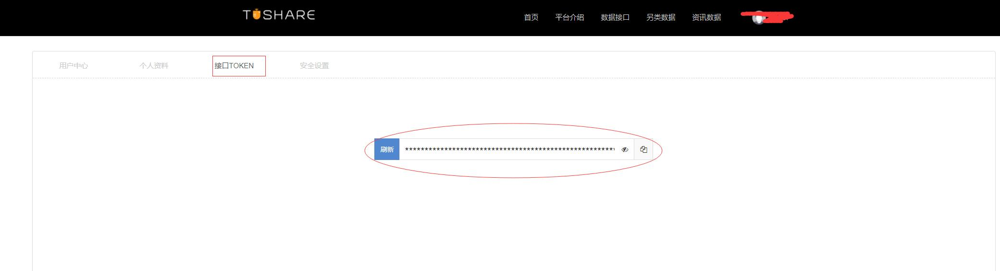
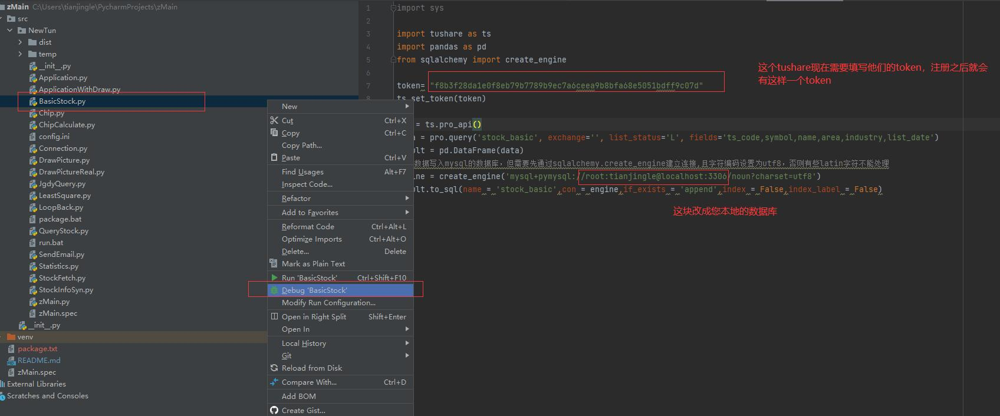
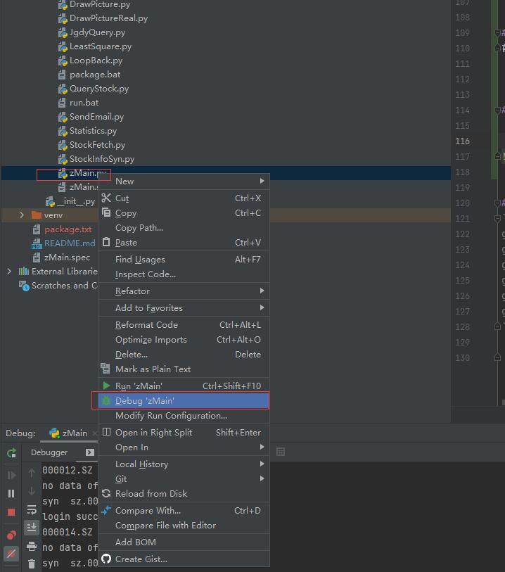
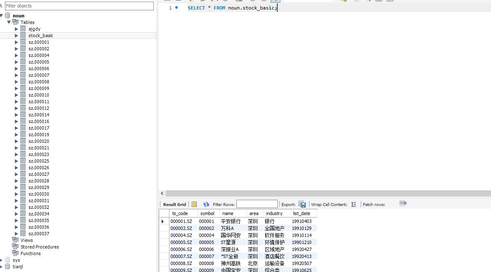

# zMain（求star，fock）
[个人学习]:整合baostack、tushare天天基金等数据源，筹码计算，多阶导数计算，k线绘制，智能选股和邮件提醒，机构调研数据获取等。

整合baostack、tushare天天基金等数据源，筹码计算，多阶导数计算，k线绘制，智能选股和邮件提醒，机构调研数据获取等。
- QQ：2695062879


# 设置数据库的sql_model
```sql
set global sql_mode='STRICT_TRANS_TABLES,NO_ZERO_IN_DATE,NO_ZERO_DATE,ERROR_FOR_DIVISION_BY_ZERO,NO_ENGINE_SUBSTITUTION';

set session sql_mode='STRICT_TRANS_TABLES,NO_ZERO_IN_DATE,NO_ZERO_DATE,ERROR_FOR_DIVISION_BY_ZERO,NO_ENGINE_SUBSTITUTION';
```

# 添加机构调研的库
- 因为代码中没有判断机构调研的情况，因此这里手动的给添加上机构调研的库
```sql
use noun;
create table ajgdy (
 id varchar(64) not null primary key,
 CompanyCode text,
 CompanyName text,
 OrgCode text,
 OrgName text,
 OrgSum text,
 SCode text,
 SName text,
 NoticeDate text,
 StartDate text,
 EndDate text,
 Place text,
 Description text,
 Orgtype text,
 OrgtypeName text,
 Personnel text,
 Licostaff text,
 Maincontent text,
 ChangeP text,
 Close text);
```

# pip基本依赖的库
```sqlite
numpy            1.20.3    #矩阵计算
panda            0.3.1     #矩阵计算库
pandas           1.2.4     #数学计算库
PyMySQL          1.0.2     #python的mysql链接
pyparsing        2.4.7     #python的sql翻译
TA-Lib           0.4.20    #量化投资必备的指标计算库
tushare          1.2.62    #tuShare股票历史数据库
baostock         0.8.8     #baoStock开源的股票历史数据库
matplotlib       3.4.2     #python做图库
scipy            1.6.3     #python科学计算库，线性回归等。
prettytable      2.1.0     #
```

# 安装办法

```sqlite
pip install numpy
pip install panda
。。。。等等等
```

# 全部依赖的库

```sqlite
Package          Version
---------------- ---------
prettytable      2.1.0
scipy            1.6.3
baostock         0.8.8
beautifulsoup4   4.9.3
bs4              0.0.1
certifi          2021.5.30
chardet          4.0.0
cycler           0.10.0
diagrams         0.20.0
graphviz         0.16
greenlet         1.1.0
idna             2.10
Jinja2           2.11.3
kiwisolver       1.3.1
lxml             4.6.3
MarkupSafe       2.0.1
matplotlib       3.4.2
numpy            1.20.3
panda            0.3.1
pandas           1.2.4
Pillow           8.2.0
pip              21.1.2
PyMySQL          1.0.2
pyparsing        2.4.7
python-dateutil  2.8.1
pytz             2021.1
requests         2.25.1
setuptools       56.0.0
simplejson       3.17.2
six              1.16.0
soupsieve        2.2.1
SQLAlchemy       1.4.18
sqlparse         0.4.1
TA-Lib           0.4.20
tushare          1.2.62
urllib3          1.26.5
websocket-client 1.1.0

```


# 安装ta-lib的方法
1. ta-lib不能直接用pip install ta-lib的方式进行安装，需要下载whl文件，然后pip install xxx.whl的方式进行安装
2. 确认自己的python的版本，比如我本地安装的是python3.8
3. 去[python第三方库](https://www.lfd.uci.edu/~gohlke/pythonlibs/#ta-lib)中下载和我们python匹配的ta-lib，因为我们的python是3.8，操作系统是64，所以我们下载cp38,64位
4. 使用管理员权限运行cmd，执行命令：pip install "C:\Users\Administrator\Downloads\TA_Lib-0.4.20-cp38-cp38-win_amd64.whl"
5. 安装完成


# 首次启动
首次启动的时候需要获取上海、深圳交易所所有的股票。然后填入我们的数据库,因为baoStock获取的数据比较差，这块用tushare，但是tushare需要填写一个token，您可能需要注册一下，然后替换掉我代码中的token即可。
https://tushare.pro/login

将tushare的token填入到BasicStock.py的token字段中。按一下操作进行



# 启动zMain


## 数据效果



# 配置文件说明
```sql
[Mysql-Database]
host=localhost   #数据库地址
user=root      #账户
passwd=tianjingle   #密码
db=noun   #数据库名称，需要提前创建
charset=utf8
[Email]
pass=tmugmrbimrcddead   #邮件密码，这是我申请的，您可以自己申请一个
user=2695062879@qq.com   #邮件密码关联的用户邮箱
sender=2695062879@qq.com   #发邮件的用户邮箱
receiver=2695062879@qq.com   #接受人的邮箱，多人用，号隔开
[System]
syn=True    #是否获取历史股票数据
scans=4000   #总计扫描多少只股票，中国股市大概有4080多只股票。
[Jgdy]
isJgdy=False   #是否获取机构调研的数据
fetchUrl=http://datainterface3.eastmoney.com/EM_DataCenter_V3/api/JGDYHZ/GetJGDYMX?js=datatable435798&tkn=eastmoney&secuCode={0}&sortfield=4&sortdirec=1&pageNum={1}&pageSize={2}&cfg=jgdyhz&p=2&pageNo={3}&_=1610583145484  #机构调研数据接口

```

# 股票池

```sql
数据库中表candidate_stock为zMain筛选的股票的历史信息。
```

# git 提交代码设置postbuffer大小
```sqlite
git pull
git add .
git commit -m '123'
git pull
git config http.postBuffer 524288000
git push
```

